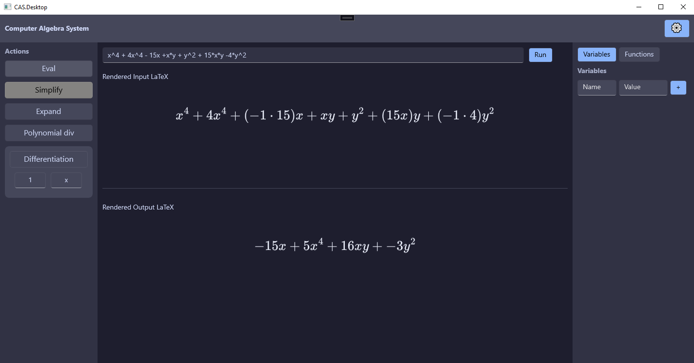
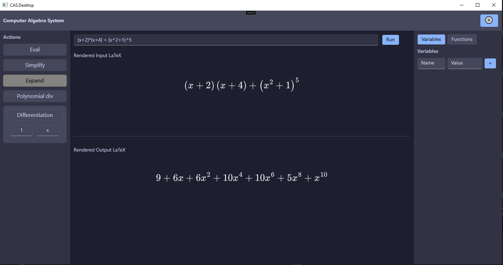
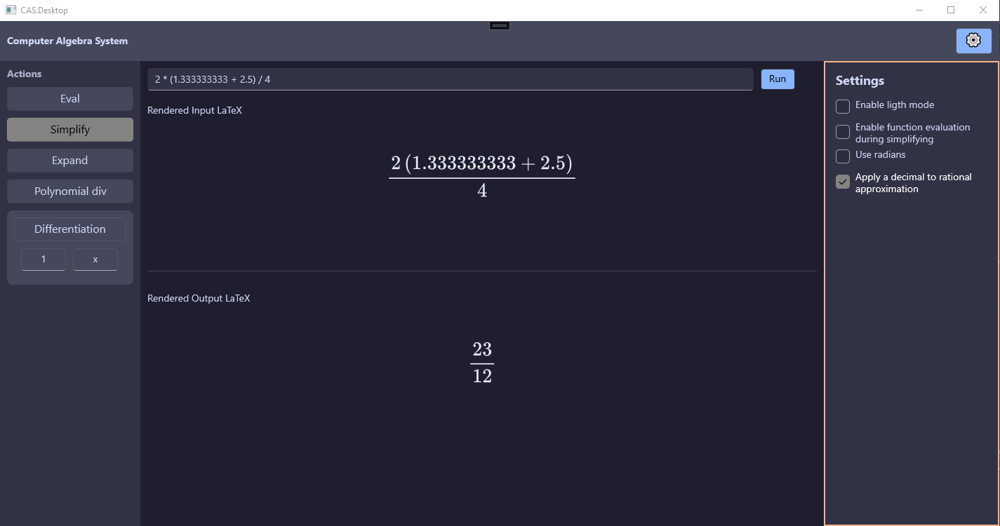
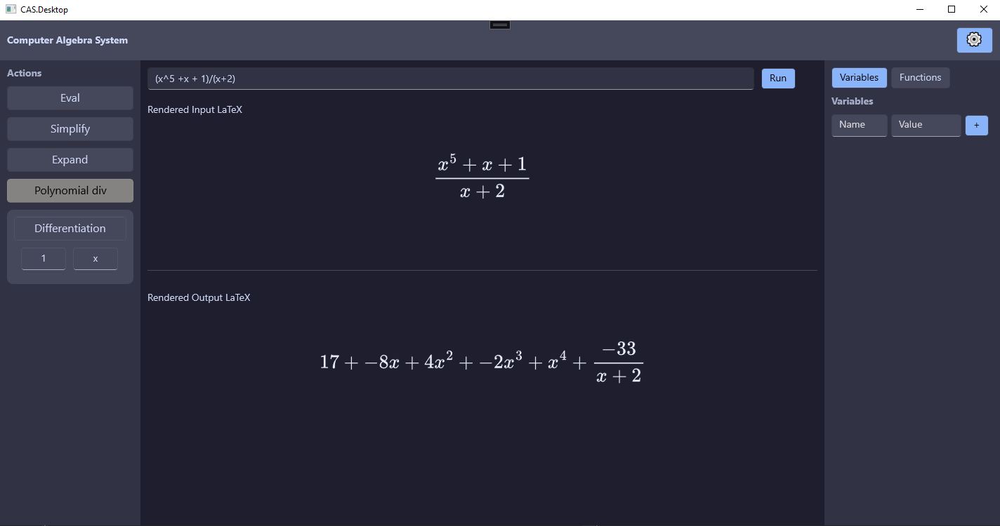
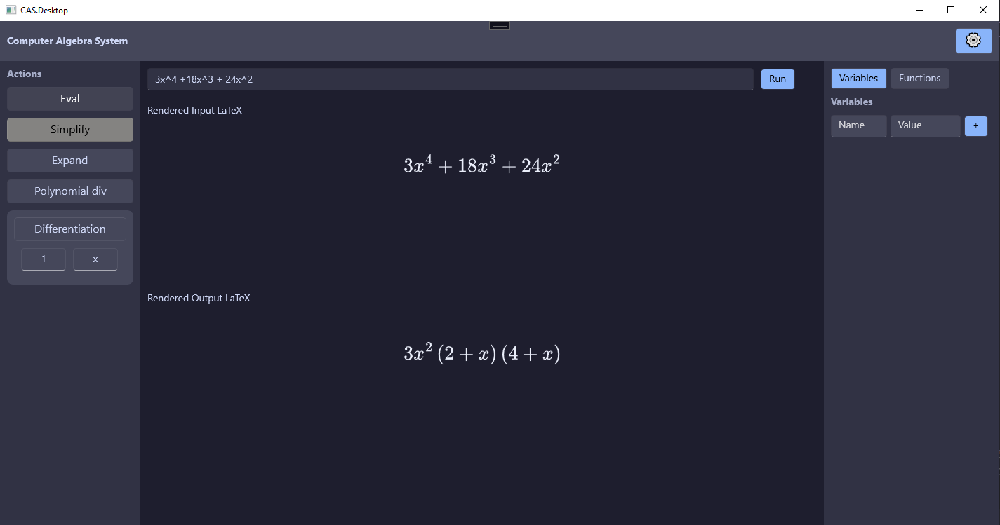
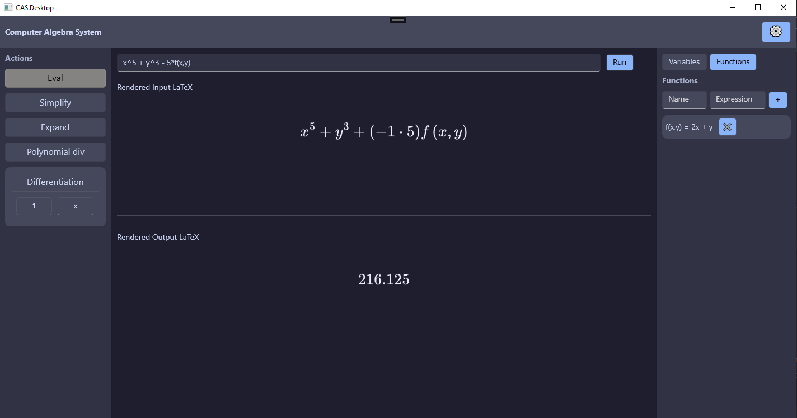
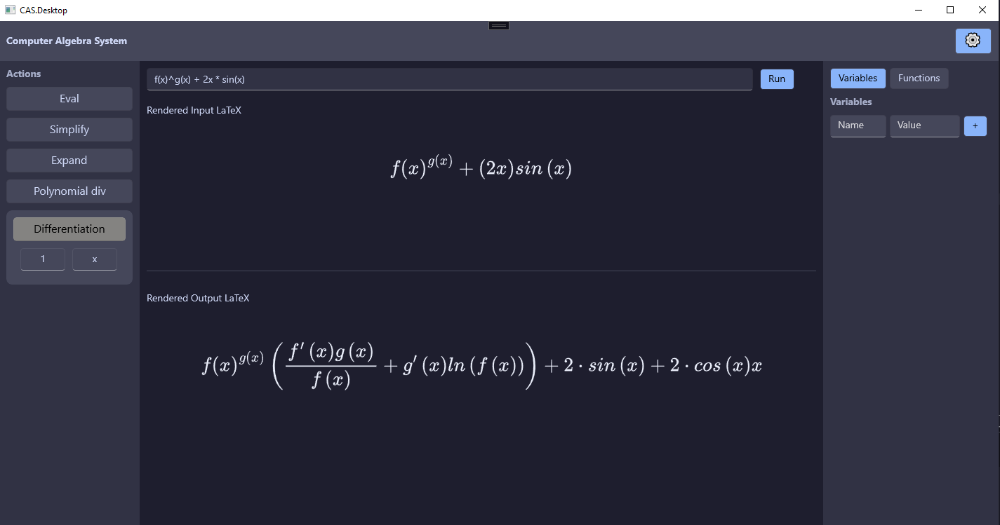

# Computer Algebra System (CAS) in C#

## 🧠 Overview

This is a **personal project** built in **C#**, designed to explore the core algorithms behind *Computer Algebra Systems* (CAS).

These kinds of tools, like *Symbolab* or *WolframAlpha*, have fascinated me for a long time. I’ve always wondered:  
> *How do they manipulate algebraic expressions as if a human were doing it?*

This project is my attempt to answer that question by implementing a symbolic algebra engine from scratch, with a strong emphasis on:

- 🎓 **Learning** — the project serves as a sandbox to better understand symbolic manipulation.
- ⚙️ **Precision** — ensuring mathematical correctness at every level.
- 🧩 **Extensibility** — making it easy to add support for new operators and features.
- 🛠️ **Maintainability** — structuring the code in a clean, testable, and well-documented way.

## 🧮 The Expression Engine

A *Computer Algebra System* (CAS), also known as a *Symbolic Calculator*, is software that enables users to manipulate mathematical expressions in ways that resemble human algebraic reasoning. These systems are especially useful for simplifying complex equations and avoiding tedious manual computations.

At its core, the engine converts user-typed input (as strings) into an **Abstract Syntax Tree** (AST), which can then be manipulated symbolically.

In this project, the engine is built around the following core classes:

- **`Token`**  
  Represents a mathematical symbol (number, operator, variable, etc.).

- **`StringTokenizer`**  
  Transforms an input string into a list of `Token`s.

- **`ASTBuilder`**  
  Converts a list of `Token`s into an `ASTNode` using the *Shunting Yard Algorithm*.

- **`ASTNode`**  
  The backbone of the engine. Represents a node in the syntax tree and implements many symbolic operations.

---

### 🔍 `ASTNode` Capabilities

#### 🔧 General Operators
- `Kind`, `NumOfOperands`, `OperandAt`
- `FreeOf`, `Substitute`, `Replace`
- `Base`, `Exponent`, `Terms`, `Const`
- `EvaluateAsDouble`, `AreLikeTerms`
- `Compare`, `Equal`

#### 📐 Polynomial Analysis
- `IsPolynomialGPE`, `DegreeGPE`, `CoefficientsGPE`
- `LeadingCoefficient`, `GetVariables`

#### 🧪 Type Checks
- `IsConstant`, `IsRational`, `IsNumber`, `IsIntegerNum`
- `IsFraction`, `IsSymbol`, `IsPower`, `IsProduct`
- `IsSum`, `IsFunction`, `IsAddOrMultiply`
- `IsUndefined`, `IsPositive`

#### 🖨️ Output
- `ToString()`
- `ToLaTeX()`

## ⚙️ Commands

There are many potential commands in a CAS, but here are the essential ones I’ve chosen to implement so far.

---

### 🧠 Simplifier

The **`Simplifier`** class provides core functionality for reducing and transforming mathematical expressions. The main method, `AutomaticSimplify`, is especially useful when building other commands, since it ensures expressions are simplified *after* each transformation, reducing boilerplate logic.

---

### 📋 Available Methods

- **`SimplifyRationalNumber(ASTNode input)`**  
  Reduces a rational expression to an irreducible fraction.

- **`AutomaticSimplify(ASTNode input)`**  
  Simplifies the input according to standard mathematical conventions.  
  *(Note: "simplified" can be subjective — the method aims to return a form commonly accepted as simplified.)*
  

- **`Expand(ASTNode input)`**  
  Expands all products and powers within the expression.
  

- **`FormatTree(ASTNode input)`**  
  Converts all numeric literals in the expression into the same number field (e.g. decimal or rational).  
  - Can force conversion of decimals to approximated fractions.  
  - Can restrict to rational-only operations.  
  - By default converts everything to decimal if any decimal is present.

  

- **`PolynomialDivision(ASTNode u, ASTNode v, ASTNode x)`**  
  Performs polynomial division of `u` by `v`, treating both as polynomials in the variable `x`.
  

- **`PolynomialFactorization(ASTNode poly, ASTNode x)`**  
  Factorizes `poly` with respect to the variable `x`.  
  - Currently supports factoring out common terms and factoring quadratics (second-degree polynomials).
  

### 🧮 Calculator

The **Calculator** is used to evaluate mathematical expressions into concrete numeric values. It can compute basic arithmetic, evaluate complex expressions, and even process user-defined variables and custom functions.

---

### 📋 Available Methods

- **`Evaluate(ASTNode root, Dictionary<string, double>? symbolTable = null, Dictionary<string, Func<List<double>, double>>? customFunctionTable = null)`**  
  Evaluates an expression tree (`ASTNode`).  
  - Supports substitution of named variables via `symbolTable`.  
  - Accepts `customFunctionTable` to define user-specific evaluation logic for named functions.

  

- **`Remainder(int a, int b)`**  
  Returns the remainder of the integer division `a / b` (i.e., `a % b`).

- **`Quotient(int a, int b)`**  
  Returns the integer quotient of `a / b`.

- **`GCD(int a, int b)`**  
  Computes the Greatest Common Divisor of `a` and `b`.

- **`SetGCD(List<int> nums)`**  
  Computes the GCD of a list of integers.

### 🔁 Differentiator

The **Differentiator** module provides symbolic differentiation of expressions represented as Abstract Syntax Trees (ASTs). It supports first and higher-order derivatives and returns a simplified version of the derivative.

---

### 📋 Available Methods

- **`Differentiate(ASTNode input, ASTNode x)`**  
  Computes the derivative of `input` with respect to the variable `x`.  
  - Acts as a partial derivative: all other variables are treated as constants.
  
  

- **`NDifferentiate(ASTNode input, ASTNode x, int n)`**  
  Applies `Differentiate` recursively **n** times to compute the **n-th derivative**.

## 🛠️ Maintainability

I put a strong emphasis on maintainability when designing this project to ensure that both I and others can easily understand, extend, and refactor the codebase in the future. Here are some practices I adopted:

- **✅ Unit Testing with xUnit**  
  More than 70 unit tests ensure the core functionality is correct and remains robust as the system evolves.

- **🔁 Reusable Code Design**  
  Used abstraction and custom operators via the `ASTNode` class to write modular and reusable components.

- **🌱 Git for Version Control**  
  Enables clean version tracking, collaborative development, and easy deployment.

- **💬 Documentation and Comments**  
  Every public method is documented with XML summaries, and inline comments are used extensively for clarity.

---

## 🔧 Tools Used

| Tool              | Purpose                    |
|-------------------|----------------------------|
| **Language**       | C#                         |
| **Test Framework** | xUnit                      |
| **IDE**            | Visual Studio 2022         |

---

## 🚀 Future Goals

Thanks to the project's modular design, it’s easy to add new features. Here are a few extensions planned for the future:

- Factorization of polynomials of degree > 2  
- Support for matrix arithmetic and algorithms  
- Solving systems of equations  
- Built-in constants (π, *e*, etc.)  
- Arithmetic over the complex field  
- Arithmetic over finite fields  
- Symbolic integration  
- Support for infinite series  
- ... and more!

---

## 📦 How to Try

You can download the current release from GitHub:  
👉 [v1.0.0 Release](https://github.com/MaeveCote/cas/releases/tag/v1.0.0)

---

## 📚 Resources & Bibliography

These are the key resources that helped me learn and build this project:

- Cohen, J. S. (2003). *Computer Algebra and Symbolic Computation: Mathematical Methods*. A K Peters.  
- SymPy Documentation – [Simplify Module](https://docs.sympy.org/latest/modules/simplify/simplify.html)  
- FreeCodeCamp – [How to Build a Math Expression Tokenizer in JavaScript](https://www.freecodecamp.org/news/how-to-build-a-math-expression-tokenizer-using-javascript-3638d4e5fbe9/)  
- Wikipedia – [Shunting Yard Algorithm](https://en.wikipedia.org/wiki/Shunting_yard_algorithm)  
- Wikipedia – [Reverse Polish Notation](https://en.wikipedia.org/wiki/Reverse_Polish_notation)  
- Stack Overflow – [Algorithm for Simplifying Decimal to Fractions](https://stackoverflow.com/questions/5124743/algorithm-for-simplifying-decimal-to-fractions)

